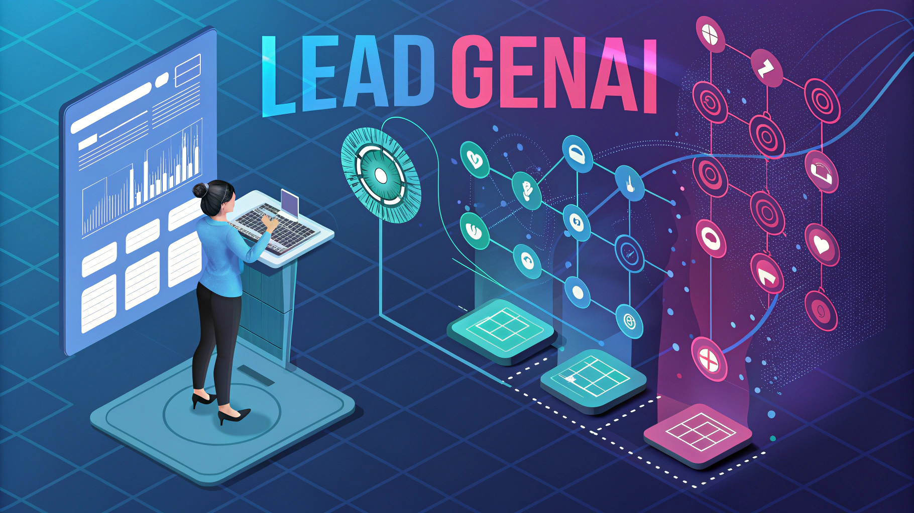

# Lead Generation Agent: A Comprehensive CrewAI Application Powered by Gemini

<p align="center">
  
</p>

This project showcases a sophisticated lead generation system built using CrewAI and powered by Google's Gemini large language model (LLM).  It automates the process of identifying and qualifying potential leads, crafting personalized sales outreach, and consolidating the findings into actionable reports, all within a streamlined and efficient workflow. This document provides a detailed overview of the system's architecture, functionality, and technical implementation.

## System Overview

The lead generation system operates on a multi-agent architecture orchestrated by CrewAI. Each agent, defined in `config/agents.yaml`, specializes in a specific task, working collaboratively to achieve the overall goal of lead generation. The workflow is defined through tasks in `config/tasks.yaml`. The process comprises four key stages:

1. **User Profile Extraction:**  The system begins by processing user-provided input, which includes a description of their services, target industries, keywords, and desired geographic location (currently focused on Argentina).  Although not explicitly defined as a separate agent in the current configuration, this stage is implicitly handled by the initial data processing within the `app.py` using Streamlit and data validation using Pydantic models (implicitly used for `UserProfile` in `utils.py`). This ensures data consistency and accuracy from the outset.

2. **Lead Research and Qualification (`BusinessResearcherAgent`):** Leveraging powerful tools like `SerperDevTool` and `ScrapeWebsiteTool` (from `crewai-tools`), the `BusinessResearcherAgent` (configured in `config/agents.yaml` and tasks in `config/tasks.yaml`) systematically identifies and qualifies potential leads. The research, driven by a dynamically generated prompt (using `build_research_prompt` in `utils.py`), targets companies in the specified industry and region, prioritizing those with a strong potential need for the user's services. This agent uses contextual analysis for qualification, going beyond simple keyword matching.  The output is a structured dataset of leads, including company name, website URL, description, and contact information. Robustness is ensured through error handling and retry mechanisms implemented using the `retry_with_logging` decorator in `utils.py`.

3. **Personalized Sales Email Generation (`SalesCopywriterAgent`):**  The `SalesCopywriterAgent` (configured in `config/agents.yaml` and tasks in `config/tasks.yaml`) crafts highly personalized sales emails using the enriched lead data. These emails, generated with `build_email_prompt` in `utils.py`, are tailored to each lead's business, challenges, and needs, enhancing engagement. They maintain a professional tone and include a clear call to action.

4. **Data Consolidation, Validation, and Reporting (`ReportingAnalystAgent`):** The `ReportingAnalystAgent` (configured in `config/agents.yaml` and tasks in `config/tasks.yaml`) consolidates all data, ensuring consistency and accuracy. This involves rigorous validation using Pydantic models (`CompanyData` in `utils.py`) before saving lead data to a Supabase database using functions in `utils.py` like `save_lead`, `search_lead`, and `check_lead_exists`.  Finally, a comprehensive report is generated, summarizing findings and the outreach strategy.

## Technical Architecture

* **Core Framework:** CrewAI (`crewai` library) orchestrates the multi-agent workflow and task management as defined in `crew.py`.
* **Large Language Model (LLM):** Google Gemini (`google-generativeai` and `crewai` with `LLM` class) powers natural language processing for personalized communication and intelligent analysis. Gemini API key is managed via environment variables loaded by `load_environment_variables` in `utils.py`.
* **Agent Configuration:** Agent roles, goals, and backstories are configured in `config/agents.yaml`, loaded using `load_yaml_config` in `utils.py`.
* **Task Configuration:** Task descriptions, expected outputs, and agent assignments are configured in `config/tasks.yaml`, loaded using `load_yaml_config` in `utils.py`.
* **Data Storage:** Supabase (PostgreSQL-based database) securely stores lead data. Database interactions are handled by functions in `utils.py` using the `supabase-py` library. Supabase credentials are loaded via environment variables.
* **Programming Language:** Python, leveraging libraries for web scraping, data processing, and LLM integration.
* **Key Libraries:**
    - `crewai`: Core framework for agent orchestration.
    - `crewai-tools`: Tools for web search and scraping (`SerperDevTool`, `ScrapeWebsiteTool`).
    - `google-generativeai`: Google Gemini LLM integration.
    - `streamlit`: User interface framework (`app.py`).
    - `requests`, `beautifulsoup4`: Web scraping utilities (implicitly used by `ScrapeWebsiteTool`).
    - `psycopg2-binary`: PostgreSQL adapter for Supabase.
    - `python-dotenv`: Environment variable management.
    - `pydantic`: Data validation (`utils.py`).
    - `yaml`: Configuration file parsing (`utils.py`).
    - `logging`: Logging and debugging (`utils.py` and throughout the application).
    - `re`: Regular expressions for text processing (if needed).
    - `typing`: Type hinting for code clarity.
    - Other libraries listed in `requirements.txt`.
* **Logging:** Comprehensive logging is implemented using `setup_logger` in `utils.py` to track application behavior, errors, and debug information, writing logs to `logs` directory.

## Installation and Deployment

### 1. Virtual Environment
Create and activate a Python virtual environment to isolate project dependencies:
```bash
python3 -m venv venv
source venv/bin/activate  # Linux/macOS
venv\Scripts\activate  # Windows
```

### 2. Install Dependencies
Install required Python packages from `requirements.txt`:
```bash
pip install -r requirements.txt
```

### 3. Configuration

#### Configuration Files
Review and adjust agent configurations in `config/agents.yaml` and task configurations in `config/tasks.yaml` to customize the lead generation process.

#### Environment Variables
Create a `.env` file in the project root and define the following environment variables:
```
GEMINI_API_KEY=your_google_gemini_api_key
SUPABASE_URL=your_supabase_project_url
SUPABASE_KEY=your_supabase_api_key
```
> **Note:** Use the **service role key** for backend operations. Ensure that the `.env` file is not committed to version control for security reasons.

The `load_environment_variables()` function in `utils.py` handles loading these variables.

### 4. Run the Application
Launch the **Streamlit** user interface to interact with the Lead Generation Agent:
```bash
streamlit run app.py
```

## Future Enhancements

### 1. Scalability
- Implement distributed task processing or asynchronous operations to handle larger datasets and improve processing speed for high-volume lead generation.

### 2. Advanced Lead Scoring
- Integrate a machine learning-based lead scoring system to prioritize leads based on predictive models evaluating their potential value and likelihood of conversion.

### 3. Multi-Lingual Support
- Extend the system's capabilities to support multiple languages for both lead research and sales outreach, broadening market reach.

### 4. Integration with CRM
- Develop seamless integration with popular CRM platforms (e.g., Salesforce, HubSpot) to automate lead data synchronization, management, and streamline sales workflows.

### 5. Real-time Monitoring and Reporting Dashboard
- Create a dedicated dashboard using tools like **Streamlit** or **Grafana** to visualize key performance indicators (KPIs), providing real-time insights into lead generation performance, agent activity, and system health.

### 6. Improved Error Handling and Resilience
- Enhance error handling to gracefully manage API rate limits, network issues, and unexpected responses from external tools, providing more informative error messages and automated retry mechanisms.

### 7. User Interface Improvements
- Enhance the **Streamlit UI** to provide more intuitive input forms, clearer output presentation, and potentially interactive data visualization of lead information and reports.

## Contact
For inquiries or collaborations, please contact:
📧 **ingenieria.d.s.g@hotmail.com**

